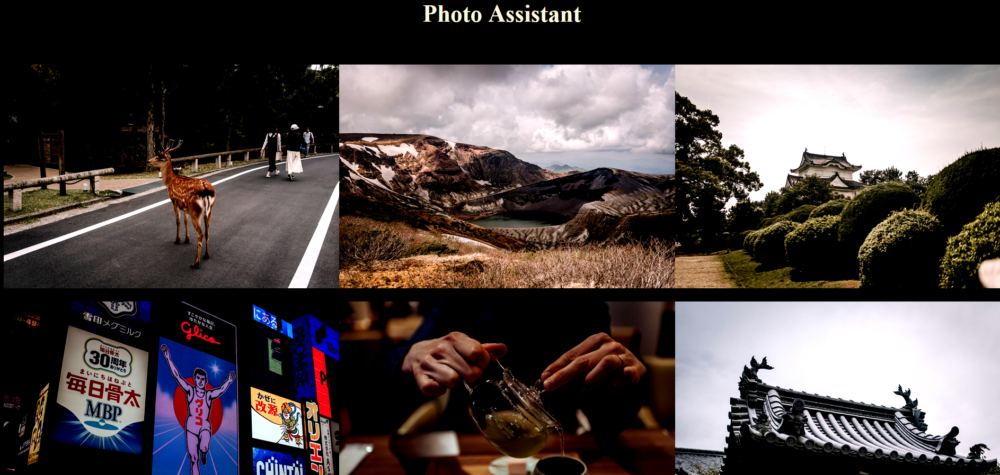
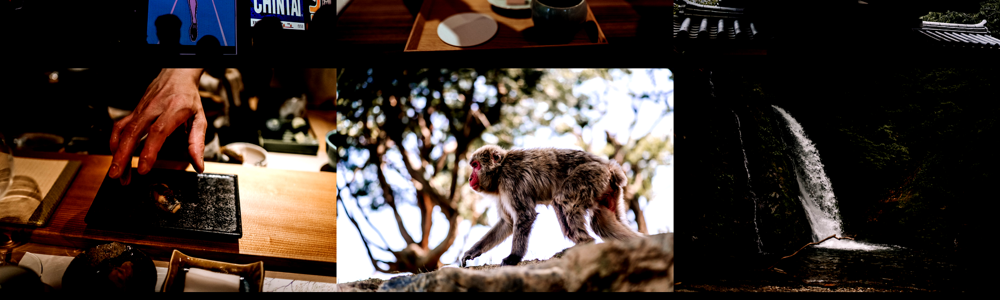

# Test report

The PhotoAssistant library has been tested with several automatic unit tests (Jest) and also in a simple test application (found in the test-app folder).

## Screenshots

Test in test-app adding contrast of 150% to images and displaying them in a grid gallery of 3 columns. Test passed.
