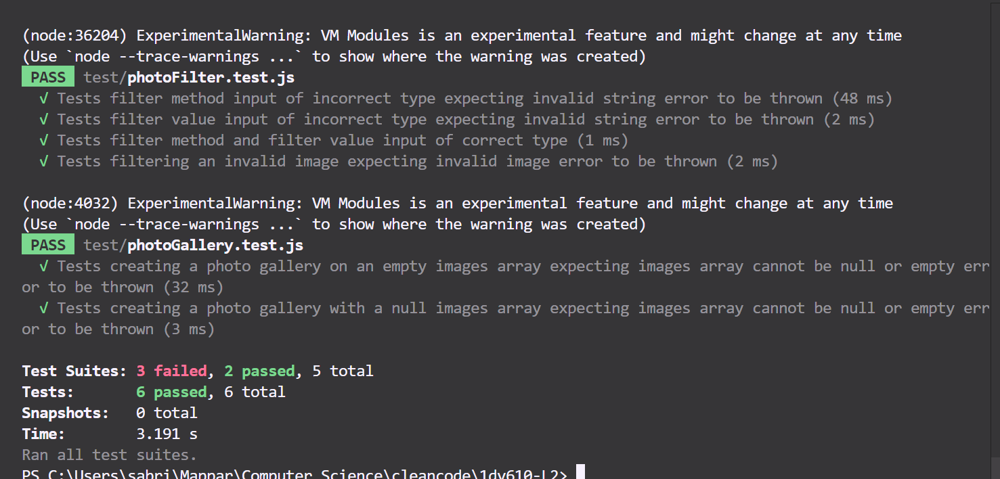

# Test report

The PhotoAssistant library has been tested with several automatic unit tests (Jest) and also in a simple test application (found in the test-app folder).

## System version

v 1.0.0

## System test

Manual testing (expected result) and automatic unit testing.

## Testing environment

Manual testing done in the test-app (run in the browser with vite) and automatic testing done with Jest.

## Test cases and result

Manual test in test-app by adding contrast of 150% to images and displaying them in a grid gallery of 3 columns. Test passed with expected result: images are displayed with the correct contrast and in the correct number of columns.

--------------------------------------------

Manual testing of the photoCanvasCreator. Test failed: the canvas was not created and the image was not drawn on the canvas as expected. Issue is still to be resolved.

--------------------------------------------

Unit testing of photoFilter and photoGallery. Tests all passed with expected result:

## Points of further improvement

## Test analysis
