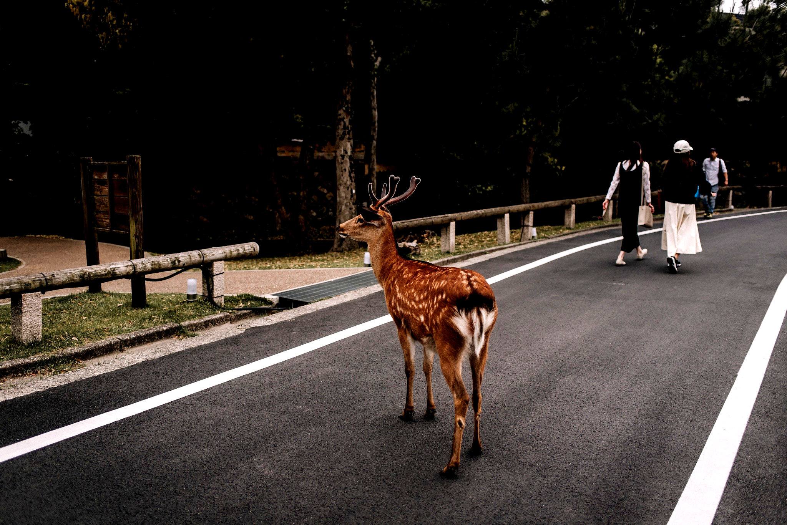
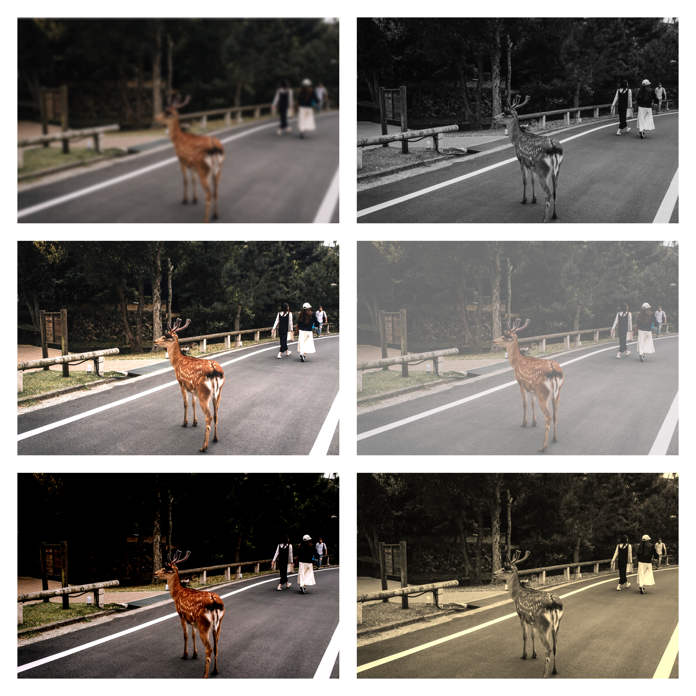
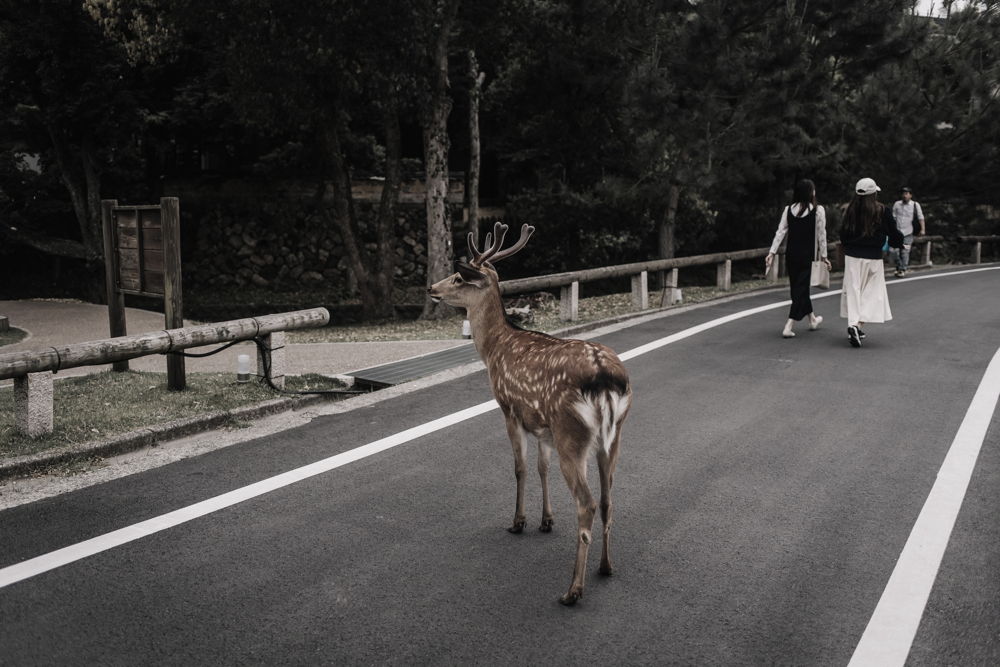
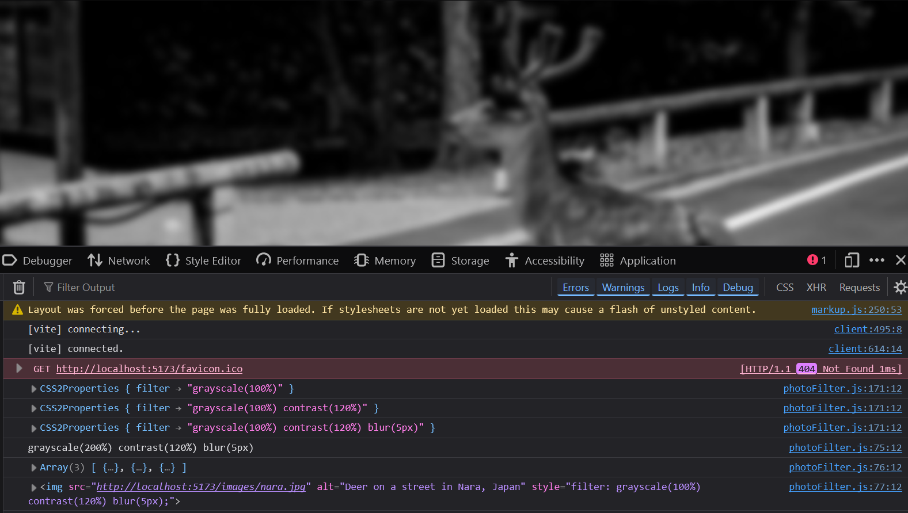
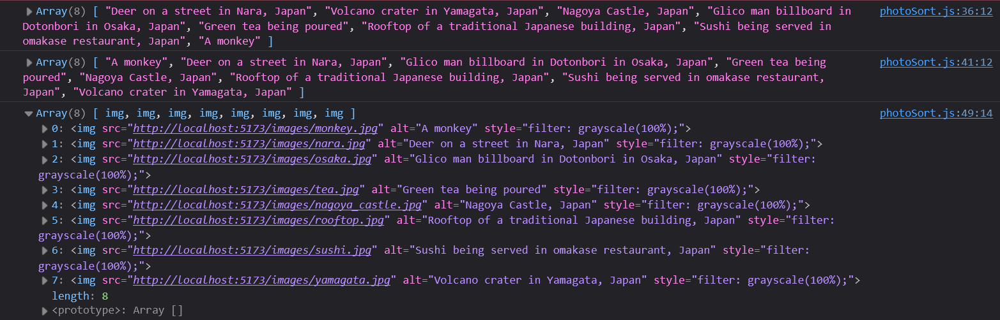
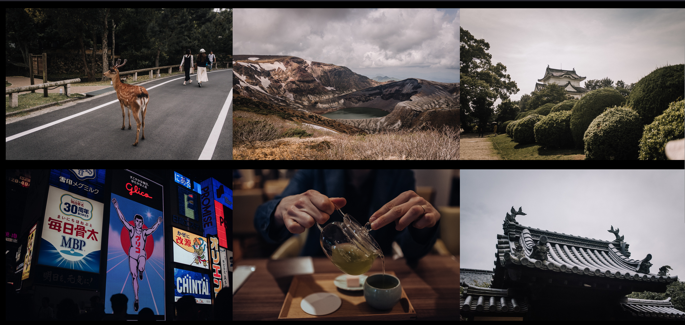
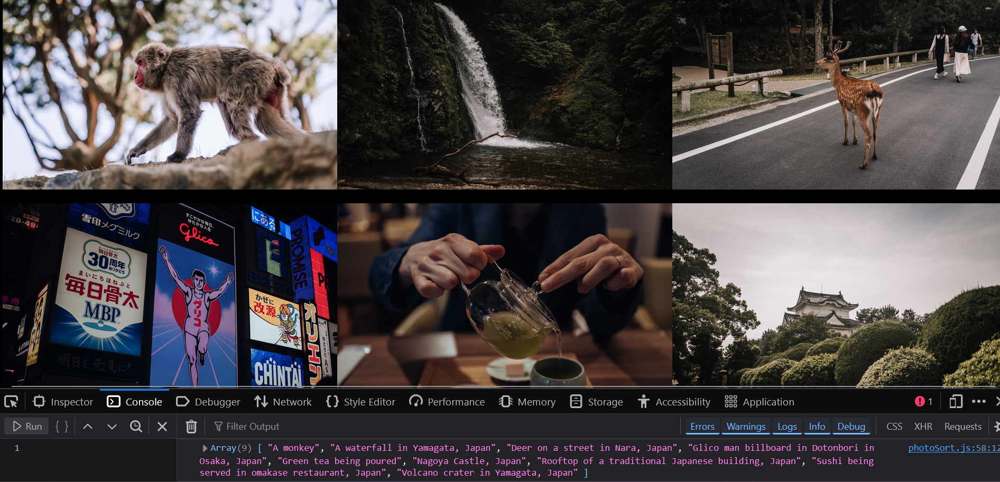
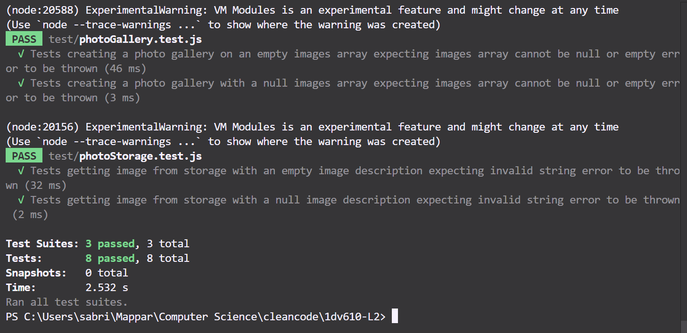
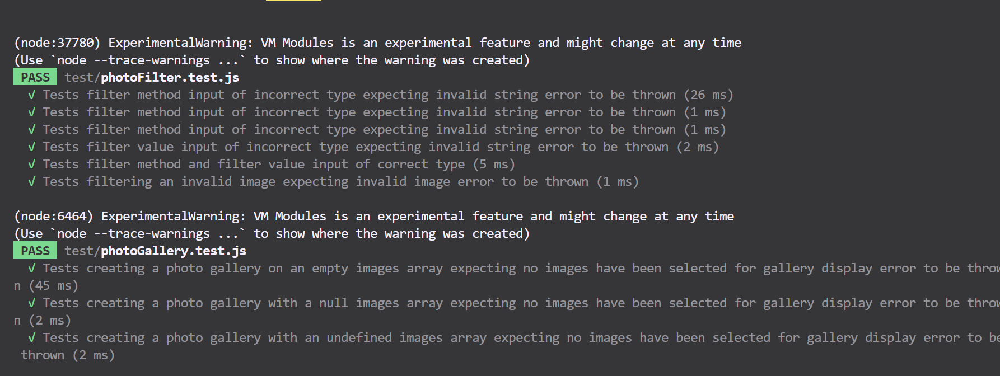
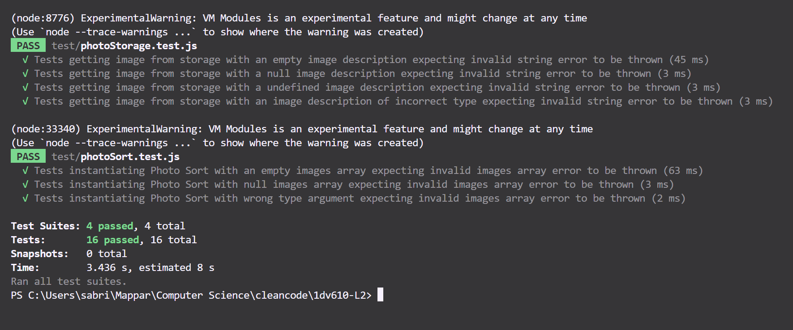

# Test report

The PhotoAssistant library has been tested with automatic unit tests (Jest) and also in a simple test application environment (found in the test-app folder) in the browser.

## System version

v 1.0.0

## System test

Manual testing (expected result) and automatic unit testing.

## Testing environment

Manual testing done in the test-app (run in the browser with vite) and automatic testing done with Jest.

## Test cases (manual testing) and result

| **Date**             | **Test**                                                                                                                                                                                                                                                | **Expected Result**                                                                                                                | **Test Result**                                                                                                                                      | **Comments**                                                                                                                                                                                                                       |
|----------------------|---------------------------------------------------------------------------------------------------------------------------------------------------------------------------------------------------------------------------------------------------------|------------------------------------------------------------------------------------------------------------------------------------|------------------------------------------------------------------------------------------------------------------------------------------------------|-----------------------------------------------------------------------------------------------------------------------------------------------------------------------------------------------------------------------------------|
| 19th Sep 2024        | Manual test of `PhotoFilter` in test-app: adding 150% contrast to a newly created `img` element and attempting to display it in the browser.                                                                                                             | The filter effect is added and the image is displayed in the browser.                                                              | Partly failed: the filter effect was added, but the image was not displayed.                                                                          | Need to update the logic to append the `img` element to the DOM to display the image.                                                                                                       |
| 20th Sep 2024        | Manual test of `PhotoFilter` in test-app: adding 150% contrast to a local image and displaying it in the browser.                                                                                                                                         | The filter effect is added and the image is displayed in the browser.                                                              | Passed with expected result.                                                                                                                          | -                                                                                                                                                                                                                                 |
| 20th Sep 2024        | Manual test of `PhotoFilter` in test-app: adding 150% contrast to an external image and displaying it in the browser.                                                                                                                                     | The filter effect is added and the image is displayed in the browser.                                                              | Failed.                                                                                                                                               | External image was blocked due to CORS policy. Decided to redesign the library to handle image elements already in the DOM to avoid CORS issues.                                             |
| 20th Sep 2024        | Manual test of `PhotoFilter` in test-app: adding 150% contrast to an image using an event listener that triggers the `addImage` method in `PhotoAssistant` with the `img` element as an argument.                                                         | The filter effect is added and the image is displayed in the browser.                                                              | Passed with expected result.                                                                                                                          | -                                                                                                                                                                                                                                 |
| 27th Sep 2024        | Manual test of `PhotoStorage` in test-app: testing image storage and retrieval via the orchestrator `PhotoAssistant` class.                                                                                                                                                                    | Images are successfully stored in local storage and a new `img` element (constructed with the original src) is returned.            | Passed with expected result.                                                                                                                          | -                                                                                                                                                                                                                                 |
| 27th Sep 2024        | Manual test of `PhotoFilter` in test-app: adding 150% contrast to images and displaying them in a grid gallery (3 columns).                                                                                                                                           | Images are displayed with the correct contrast and in the correct number of columns.                                               | Passed with expected result.                                                                                                                          | -                                                                                                                                                                                                                                 |
| 28th Sep 2024        | Manual test in test-app of extracting image metadata in `PhotoSorting` class.                                                                                                                                                                                        | The metadata of the image is extracted and displayed in the console.                                                               | Failed.                                                                                                                                               | Metadata extraction failed due to browser incompatibility with `exif` package and unresolved bug in `exif-js`. Decided to scrap the `PhotoSorting` class.                                     |
| 29th Sep 2024        | Manual test of `PhotoCanvasCreator` in test-app: creating a canvas and drawing an image on it with 150% contrast applied.                                                                                                                                            | The canvas is created and the image is drawn with the filter effect.                                                               | Failed initially but passed after debugging.                                                                                                          | After fixing the issue, the image was successfully drawn on the canvas with the contrast effect applied.                                                                                    |
| 29th Sep 2024        | Manual test in test-app of applying additional filter effects (brightness, grayscale, blur, sepia, saturation, opacity) to an image drawn on the canvas.                                                                                                             | All filter effects are applied to the image on the canvas.                                                                         | Most tests passed, but opacity and saturation failed.                                                                                                 | Opacity effect was visible after viewing the image in another tab. Saturation did not appear at all. Need to investigate these two issues further.                                            |
| 30th Sep 2024        | Manual test in test-app of applying saturation filter effect (40%) to image drawn on canvas.                                                                                                         | Saturation effect being applied to the image on the canvas.                                                                         | Passed with expected result.                                                                                               | When debugging I found that I had spelled the filter effect as 'saturation' instead of the correct 'saturate', which is why the effect wasn't applied during previous testing.                                  |
| 30th Sep 2024        | Manual test in test-app of applying opacity filter effect (40%) to image drawn on canvas.                                                                                                         | Opacity effect being applied to the image on the canvas.                                                                         | Passed with expected result.                                                                                               | I'm not sure why the opacity is visible on the canvas this time, without needing to open up a new tab. Could have possibly been a browser issue during the previous test?                               |
| 1st Oct 2024         | Manual test in test-app to see if sorting of images (in alphabetical order) in `PhotoSort` class is successful.                                                                                                    | Images to be sorted in alphabetical order based on their alt descriptions.                                                                         | Passed with expected result.                                                                                               |                               |
| 1st Oct 2024         | Manual test in test-app of adding multiple filter effects to an image.                                                                                           | Images to be edited with all of the chosen filter effects.                                                                        | Failed.                                                                                               |  Reason for failed test: when the next filter effect was added in the iteration, the previous one is replaced.                             |
| 1st Oct 2024         | Manual test in test-app of adding multiple filter effects to an image.                                                                                           | Images to be edited with all of the chosen filter effects.                                                                        | Passed with expected result.                                                                                              |  Fixed the issue described in the previous test case by creating a method to concatenate a string and using it to apply all the filter effects to the the image style at once.                       |
| 1st Oct 2024         | Manual test in test-app of displaying images in original order, after having added logic to be able to display them in alphabetical order.                                                                                        | Images to be displayed in a 3 column grid gallery in original order that they were selected.                                                          | Failed.                                                                                             |  When debugging I found that I have missed to add .length to the control statement in the `PhotoAssistant` class that checks if images from sortedImages array should be displayed in gallery or from the original, unordered images array.                      |
| 1st Oct 2024         | Manual test in test-app of displaying images in original order, after having added logic to be able to display them in alphabetical order.                                                                                        | Images to be displayed in a 3 column grid gallery in original order that they were selected.                                                          | Passed with expected result.                                                                                             |  Fixed the issue described in the previous test case.                     |

--------------------------------------------

### Screenshots of test results from manual testing in the test-app

Result of filtering images (contrast 150%) and displaying them in a grid gallery (3 columns):

Result of filtering images with the filter effects (contrast, brightness, grayscale, blur, sepia, saturation, opacity) and drawing them on a canvas:

### Before

Original image without filter effect.

### After

Canvas drawn image with filter effect (contrast 150%).

Canvas drawn images with filter effects (blur, grayscale, brightness, opacity, contrast, sepia). Saturation effect did not show.

Result of adding saturation filter effect (40%) to image drawn on canvas after debugging and fixing the issue:

Result of adding multiple filter effects to an image (grayscale of 200%, contrast of 120% & blur of 5px):

Result of image sorting test:

Images displayed in gallery in original order:

Images displayed in gallery in alphabetical order:

--------------------------------------------

### Results of automatic unit tests (Jest)

Final unit testing results (unit tests have also been updated to test the updated code):

